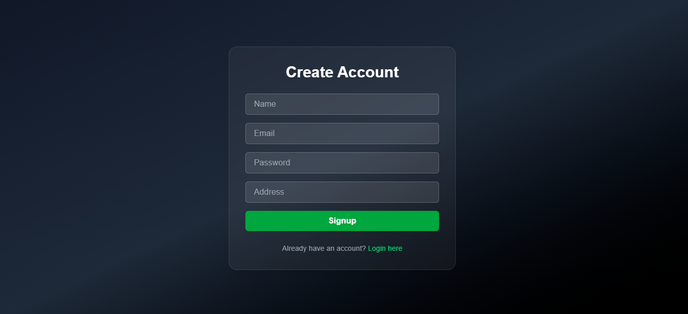
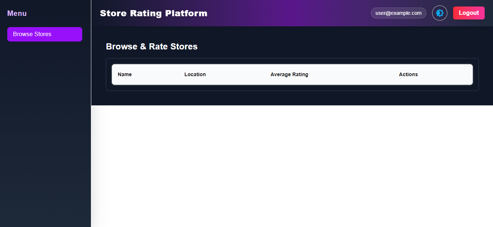
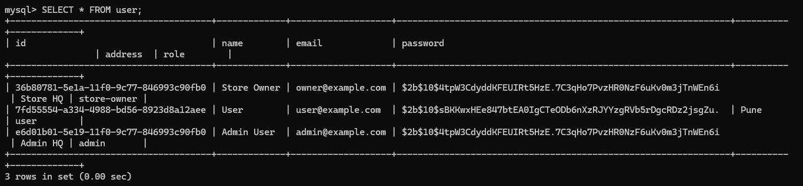

# 📊 Store Rating Platform - Demo

This project is a full-stack **Store Rating Platform** built using React.js (frontend), NestJS (backend), and MySQL (database). Below are some visuals that demonstrate the UI and the corresponding data shown in the database.

---

## 🖼️ 1. UI Screenshots

### 🔐 Login Page

### 📝 Signup Page

### 🧑‍💼 Admin Dashboard

---

## 🗃️ 2. MySQL Database Screenshots

### 👤 `users` Table
Shows data after user registration.

---

## 🔗 Repository

👉 [GitHub Link](https://github.com/chetanchunole1804/Store-Rating-Platform)

---

> ℹ️ Make sure you have the `.env` file and required environment variables set up for local development.
